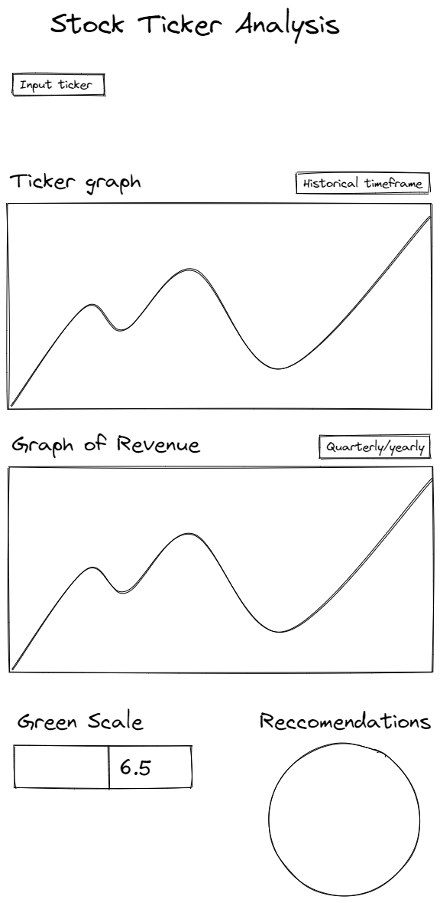

# Stock Samurai
## TODO 
- Develop project outline
- Develop green index
- Develop twitter stock sentiment index
- Develop bollinger band + green/sentiment trading algo?

## Resources
- https://github.com/ranaroussi/yfinance/blob/main/README.md 
- https://pypi.org/project/yfinance/
- https://dash.gallery/dash-opioid-epidemic/

## Front End (Streamlit)
- Dashboard style
- https://medium.com/@hamzarabi303/stock-forecasts-dashboard-with-streamlit-introduction-to-streamlit-865901b352c3
- https://python.plainenglish.io/building-a-stock-market-app-with-python-streamlit-in-20-minutes-2765467870ee
- https://www.geeksforgeeks.org/create-and-deploy-a-stock-price-web-application-using-python-and-streamlit/
- https://www.youtube.com/watch?v=JwSS70SZdyM&ab_channel=freeCodeCamp.org
- https://github.com/dataprofessor/streamlit_freecodecamp/blob/main/app_5_eda_sp500_stock/sp500-app.py
- https://medium.com/xaipient/attribution-heatmaps-using-streamlit-and-xaipient-explanations-api-824100656e00

  
### Contents of Dashboard
- Graph of stock, editable (change timeframe?)
- Graph of quarterly + yearly revenue 
- Last 5 recommendations - pie chart? 
- GREEN SCALE color bar heatmap style

# Outline
